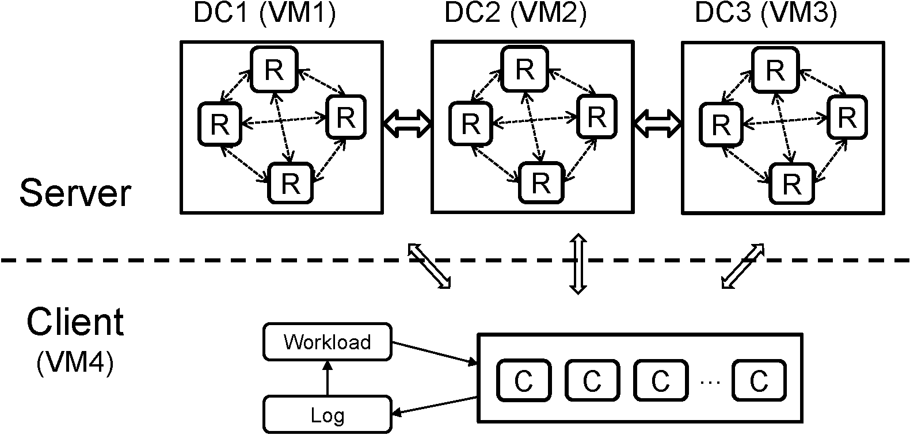

# CRPQ Experiments

There are 3 folders here:

* *redis_test* : The testing bash scripts. Also used in the experiment.
* *bench* : The experiment code. Constructs the experiment, generates and runs operations, get logs and results. 
* *result* : The results and the data analysis.

To redo our CRPQ experiments, setup the experiment as shown above. We use VMware to run 4 virtual machines. VM 1-3 run Ubuntu server 16.04.5 LTS. VM4 runs Ubuntu desktop 16.04.5 LTS. Each of VM 1-3 is deployed with Redis server instances and simulates a data center. VM4 runs all the clients. 

The ips of VM 1-3 are *192.168.188.135*, *192.168.188.136*, *192.168.188.137*. You need to modify the ip settings in *bench/main.cpp* and *redis_test/connection.py* if you want to use other ips for servers.

Then start the experiment:

    cd bench
    make run

After it finished you will get the data in the *result* folder. 
You may then draw figures by (python 3.6 required):

    cd ../result
    python result.py

Note that there may be some bugged results that are apparently invalid. You may find them by using the according find function in *result/result.py*, and then fix them by use the according fix functions in *bench/main.cpp* accordingly.

For more detail of our implementation, please read the *Performance measurements* section of [the technical report](https://arxiv.org/abs/1905.01403).
